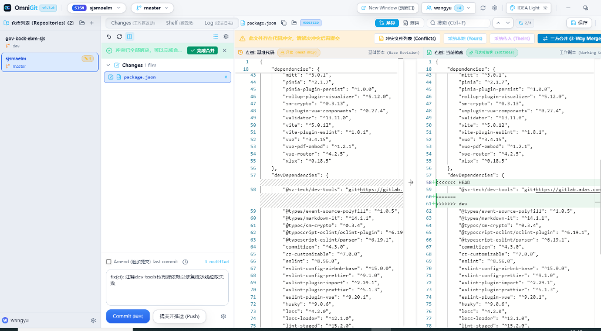

# OmniGit - High-Performance Multi-Repository Git Desktop Workbench 🚀

> **The beloved IntelliJ IDEA Git workflow & powerful 3-Way Merge conflict resolver, extracted into a lightweight, standalone, open-source desktop client.**  
> Built for multi-repo & microservices collaboration · Fine-grained selective push · Real-time external conflict auto-healing · 0ms Optimistic UI · Sub-second Startup · Offline Privacy-First · Free & Open-Source

**English** | [简体中文](README.md)

[](https://github.com/BucanYu/OmniGit/releases)
[](https://github.com/BucanYu/OmniGit/releases)
[](LICENSE)
[](https://github.com/BucanYu/OmniGit/stargazers)

---

### 📦 Download Latest Release (v0.4.0)

| Platform | Package Format | Download Link (GitHub Releases) | Highlights |
| :--- | :--- | :--- | :--- |
| **Windows x64** | **Setup Installer** | 👉 **[OmniGit-Setup-0.4.0.exe](https://github.com/BucanYu/OmniGit/releases/latest)** | Recommended: customizable path, auto-updates, **Zero UAC Elevation** |
| **Windows x64** | **Portable (ZIP)** | 👉 **[OmniGit-win32-x64.zip](https://github.com/BucanYu/OmniGit/releases/latest)** | No installation needed, extract and launch `OmniGit.exe` instantly |
| **macOS (Apple Silicon)** | **Portable App (ZIP)** | 👉 **[OmniGit-v0.4.0-mac-arm64.zip](https://github.com/BucanYu/OmniGit/releases/latest)** | Optimized for Apple Silicon M1 / M2 / M3 / M4 Macs |
| **macOS (Intel x64)** | **Portable App (ZIP)** | 👉 **[OmniGit-v0.4.0-mac-x64.zip](https://github.com/BucanYu/OmniGit/releases/latest)** | Compatible with Intel-based Macs |

---

## 📸 Interface Preview



---

## 💡 Why OmniGit?

Every developer (especially those working in VS Code, Sublime, or terminal environments) faces these familiar frustrations:

1. **Resolving Merge Conflicts is Stressful**: Manually hunting down `<<<<<<< HEAD` markers in standard editors is error-prone, carrying the constant risk of corrupting remote code or breaking CI pipelines;
2. **Full IDEs Are Too Heavy**: IntelliJ IDEA and WebStorm offer the gold standard for visual conflict resolution, but consume 2–4 GB of RAM and take 30 seconds to launch. Opening a heavy IDE just to resolve one Git conflict heats up your laptop;
3. **Inflexible Commit & Push Controls**: In agile sprints, urgent bug fixes often interleave with unverified feature commits. Traditional clients force you to push all commits or perform tedious manual branch checkouts and cherry-picks;
4. **Desync with External Editors**: When you resolve conflicts in your favorite editor and save, most Git clients remain stuck on the conflict screen until you manually execute `git add`;
5. **Flaws of Existing Standalone Clients**:
   - **SourceTree**: Clunky, slow, prone to freezing on Windows, and mandates an Atlassian login;
   - **GitKraken**: Increasingly commercialized; paywalls private repos and merge conflict resolution behind monthly subscriptions;
   - **Fork**: Excellent experience, but proprietary closed-source and costs $49.99.

**OmniGit ends these compromises.** It packages JetBrains' ergonomic Git workflow and visual 3-Way Merge into a standalone client that **starts in 1 second, uses only ~60MB of memory, and is completely free and open-source.**

---

## ✨ Killer Features

### 1. 🎯 JetBrains-Grade 3-Way Merge Conflict Resolver
- **Intuitive 3-Column View**: Left: Local changes (Yours) · Center: Merged result · Right: Incoming changes (Theirs);
- **1-Click Bidirectional Merging**: Click arrows to cleanly accept or discard changes with live preview;
- **Safety Barrier Against Raw Markers**: Blocks commits if any file still contains unmerged `<<<<<<<` markers;
- **External Resolution Auto-Healing**: When conflict markers are removed and saved in external editors (VS Code, Sublime), OmniGit automatically stages changes and clears the conflict state in real-time.

### 2. 🚀 Fine-Grained Branch & Commit Push (Selective Push)
- **Zero-Checkout Branch Selection**:
  - Switch source and target branches directly in the push dialog without physically checking out branches locally;
- **Commit Multi-Selection & Independent Push**:
  - Check individual commits or batches of commits with independent checkboxes;
  - Push selected commits directly to the remote branch, or create and push a dedicated patch branch (e.g. `patch/fix-xxx`) for Code Review / PR without touching your local working tree;
- **Push Up To Here**:
  - Right-click any commit card to push history up to that specific commit, isolating unverified subsequent work;
- **Cross-Branch Commit Sync**:
  - Right-click in the Commit Log to cherry-pick and sync commits directly to another branch (e.g., `test`, `uat`), with an optional automatic remote push.

### 3. ⚡ 1-Click "Undo Merge" with Historical Recovery
- Ever merged a branch (e.g. `merge dev`) and immediately wished you could revert?
- OmniGit provides a persistent **Undo Merge** action with smart HEAD inspection and high-risk confirmation, restoring your working tree to its pre-merge state instantly—even after app restarts.

### 4. 🖥️ IntelliJ IDEA Ergonomics & Keybindings
- **Classic Commit Panel**: Changes tree, side-by-side Monaco diff viewer, Amend commit checkbox, and Rollback action;
- **Pure Bilingual Experience**: Clean, natural localized labels without mixed brackets; hover tooltips reveal standard English terminology and IDEA keybindings (`Ctrl+K` to commit, `Ctrl+Shift+K` to push);
- **Classic Themes**: Pre-loaded with Darcula, IDEA Light, and Nord Frost themes.

### 5. 📂 Multi-Repository Workspace Management
- Built for microservices, monorepos, and multi-package teams;
- Aggregate and manage multiple repositories in a single window with real-time incoming/outgoing counters (`↗` / `↘`) and instant switching;
- **Accurate Context Persistence**: Remembers and restores the active project and workspace group across restarts with 100% accuracy.

### 6. ⚡ 0ms Optimistic UI & Strict Offline Privacy
- **0ms Instant Hydration**: Combines L1 memory, L2 LocalStorage, and L3 disk snapshots for instant boot without white screens;
- **Streaming Git Clone Progress**: Displays real-time transfer percentage, network speed metrics, and live logs with unlimited timeout for large repos;
- **Zero Cloud Leakage**: Runs offline via an embedded local loopback engine. Your code and credentials never leave your machine.

---

## 📊 Comparison with Mainstream Git Clients

| Feature | **OmniGit** | SourceTree | GitKraken | Fork | VS Code Built-in |
| :--- | :---: | :---: | :---: | :---: | :---: |
| **Open Source & Price** | **100% Free & MIT** | Free (Closed Source) | Freemium ($$ Subscription) | $49.99 Paid | Free & Open Source |
| **3-Way Merge Resolver** | **Native 3-Panel Visual** | Needs external tool | Paywalled feature | Supported | Requires heavy extensions |
| **External Conflict Auto-healing**| **Native Real-Time Auto-Stage**| None | Manual refresh | None | None |
| **Fine-Grained Selective Push** | **Commit checkboxes & patch branch** | Full branch only | Complex | Basic | Full branch only |
| **1-Click Undo Merge** | **Native with Auto-recovery** | Complex CLI commands | Complex reflog rollback | Manual revert | None |
| **Cross-Branch Commit Sync** | **Log context menu Cherry-pick** | Manual checkout | Tedious | Supported | Manual CLI commands |
| **IntelliJ Ergonomics** | **Deep 1:1 Parity** | Outdated layout | Custom UI | Mac style | Basic tree view |
| **Startup & Memory** | **Sub-second (~60MB)** | Heavy, frequent lags | Heavy (Electron) | Fast native | Tied to whole editor |
| **Multi-Repo Workspace** | **Native Aggregate View** | Multi-tab | Weak | Multi-tab | Needs multiple windows |
| **Account Lock-in** | **Zero Login Needed** | Mandatory Atlassian | Mandatory registration | None | None |

---

## 🛠️ Local Development Guide

All automation and runner scripts are located in the [`scripts/`](scripts/) directory (see [`scripts/README.en.md`](scripts/README.en.md)):

### 1. Launch Desktop Preview
```bash
# Option 1: Double click scripts/start_desktop.bat
# Option 2: Via terminal
cd app
npm run electron:preview
```

### 2. Web Development Mode (HMR)
```bash
# Option 1: Double click scripts/start_dev.bat (opens http://localhost:5345)
# Option 2: Via terminal
cd app
npm run dev
```

### 3. Build Windows Installer Package
Double-click: 👉 **[`scripts/build_desktop.bat`](scripts/build_desktop.bat)**.  
The script compiles TypeScript, bundles Vite assets, and uses portable NSIS to generate the single-file installer in `app/release/`.

---

## 📂 Project Structure

```text
OmniGit/
├── app/                              # Application Core
│   ├── electron/                     # Electron Main Process & Auto-update
│   │   ├── main.ts                   # Window lifecycle, private Git API server, probing
│   │   ├── preload.ts                # Secure preload script
│   │   └── updater.ts                # GitHub Releases auto-updater
│   ├── src/                          # Frontend Source (React 18 + Zustand + Tailwind)
│   │   ├── components/               # Common components (Modal, Button, Input, Dropdown)
│   │   ├── features/                 # Core feature modules
│   │   │   ├── conflict-3way/        # 3-Way Merge visual conflict resolver
│   │   │   ├── diff/                 # Monaco side-by-side / inline diff viewer
│   │   │   ├── git-log/              # Commit log, branch tree & cross-branch sync
│   │   │   ├── git-push/             # Branch selector, selective multi-commit push modal
│   │   │   ├── status/               # Changes tree, Shelf panel
│   │   │   ├── topbar/               # Top branch menu, Undo merge, identity switcher
│   │   │   └── workspace/            # Multi-repo workspace manager & welcome screen
│   │   ├── locales/                  # Pure bilingual i18n dictionaries (zh-CN / en-US)
│   │   ├── server/                   # Local Git scheduler engine & API (gitService)
│   │   └── store/                    # Zustand store (useAppStore, 0ms optimistic UI)
│   ├── electron-builder.yml          # NSIS installer configuration
│   └── package.json                  # Dependencies & scripts
├── docs/                             # Architecture, PRD, guides & image assets
│   ├── images/                       # UI preview assets
│   └── OmniGit_Tutorial_Guide.docx   # Illustrated tutorial guide for non-IDEA users
├── scripts/                          # Developer automation toolbox & portable NSIS
└── README.md                         # Main documentation (Chinese)
```

---

## 🤝 Contributing & Feedback

Contributions, bug reports, and ideas are warmly welcomed!
- Found a bug or have a suggestion? Open an [Issue](https://github.com/BucanYu/OmniGit/issues)
- If you find OmniGit useful, please give us a ⭐️ **Star** to support the project!

---

## 📄 License

This project is open-source software licensed under the [MIT License](LICENSE).
