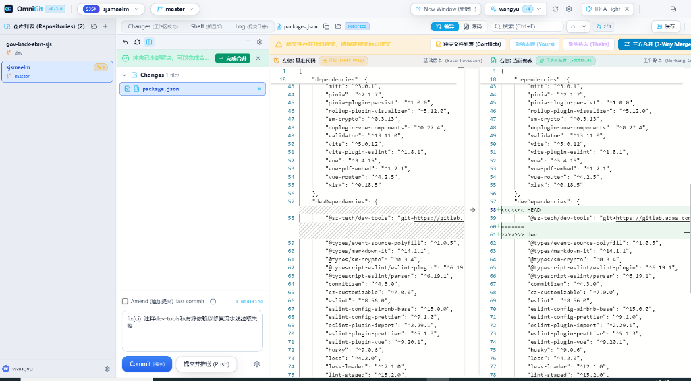

# OmniGit - 极速跨仓库 Git 桌面工作台 🚀

> **把 IntelliJ IDEA 广受赞誉的 Git 提交体验与 3-Way Merge 冲突合并神器，做成轻量秒开的独立桌面端！**  
> 专为微服务/多工程并行协作打造 · 0ms 乐观更新 · 毫秒级秒开 · 隐私离线安全 · 永久免费开源

[English](README.en.md) | **简体中文**

[](https://github.com/BucanYu/OmniGit/releases)
[](https://github.com/BucanYu/OmniGit/releases)
[](LICENSE)
[](https://github.com/BucanYu/OmniGit/stargazers)

---

### 📦 立即下载最新稳定版

| 平台 | 交付物类型 | 下载通道 (GitHub Releases) | 特性说明 |
| :--- | :--- | :--- | :--- |
| **Windows x64** | **单文件安装包** | 👉 **[OmniGit-Setup-0.4.0.exe](https://github.com/BucanYu/OmniGit/releases/latest)** | 推荐体验：支持自定义安装路径、在线增量更新、**彻底免 UAC 提权** |
| **Windows x64** | **绿色便携版 (ZIP)** | 👉 **[OmniGit-win32-x64.zip](https://github.com/BucanYu/OmniGit/releases/latest)** | 免安装，解压后双击 `OmniGit.exe` 即可使用，适合受限工作机 |
| **macOS (Apple Silicon)** | **便携应用包 (ZIP)** | 👉 **[OmniGit-v0.4.0-mac-arm64.zip](https://github.com/BucanYu/OmniGit/releases/latest)** | 适配 M1 / M2 / M3 / M4 芯片 Mac，解压即用 |
| **macOS (Intel x64)** | **便携应用包 (ZIP)** | 👉 **[OmniGit-v0.4.0-mac-x64.zip](https://github.com/BucanYu/OmniGit/releases/latest)** | 适配 Intel 架构 Mac，解压即用 |

---

## 📸 界面预览 (Interface Preview)



---

## 💡 为什么需要 OmniGit？

日常编码中，很多开发者（尤其是使用 VS Code、Sublime 或命令行终端的工程师）经常面临这些痛点：

1. **分支合并冲突太令人头疼**：普通编辑器里手动改 `<<<<<<< HEAD` 提心吊胆，生怕手滑改错或把远程代码删了；
2. **大型 IDE 太重太吃内存**：IntelliJ IDEA / WebStorm 的 Git 冲突合并确实是行业天花板，但动辄霸占 2~4GB 内存，启动要等半分钟。只为了处理一个 Git 冲突而开 IDE，电脑卡得发烫；
3. **主流独立 Git 客户端缺陷明显**：
   - **SourceTree**：界面老旧、在 Windows 上频繁无响应假死，还强绑 Atlassian 账号；
   - **GitKraken**：越来越商业化，私有仓库和三方合并冲突强制按月付费；
   - **Fork**：体验虽好，但为商业收费软件（$49.99 且闭源）。

**OmniGit 为终结这些痛点而生**——它将 JetBrains 最受开发者推崇的 Git 交互哲学与 3-Way Merge 完整抽离，封装成一个**启动只需 1 秒、内存仅几十兆、完全免费开源**的轻量桌面工作台。

---

## ✨ 五大核心杀手锏特性

### 1. 🎯 专业级 3-Way Merge 可视化冲突解决神器
- **直观三栏比对**：左侧本地修改 (Yours) · 中间合并结果 (Result) · 右侧传入修改 (Theirs)；
- **双向箭头一键采纳**：单机箭头智能保留/丢弃代码，中间区域实时生成最终结果，彻底告别手工编辑标记的恐惧；
- **防手滑安全屏障**：若工作区仍有包含 `<<<<<<<` 标记的冲突文件，系统坚决阻断提交并给出精准高亮指引，绝不让半成品代码流入主分支。

### 2. ⚡ 独创“撤销合并 (Undo Merge)”安全回退机制
- 分支合并（如 `git merge dev`）后发现改动过多想反悔？
- 顶部专属提供 **1-Click 撤销合并**，即使中途客户端重启或清理缓存，依然能从 Git 历史树中智能锚定合并前状态，一秒无损复原工作区。

### 3. 🖥️ IntelliJ IDEA 原生级交互质感
- **经典提交面板**：完美还原 Changes 工作区改动列表、单/双栏 Monaco 差异编辑器、Amend 追加提交、Rollback 快速撤销；
- **无缝操作习惯**：内置 Darcula、IDEA Light、Nord Frost 等经典主题，支持 `Ctrl+K` 调出提交、`Ctrl+Shift+K` 一键推送。

### 4. 📂 跨仓库与微服务工作区管理
- 微服务、Monorepo、前后端多工程协作开发者的利器；
- 在同一个工作台中聚合管理多个项目仓库，实时呈现各仓库未提交改动与进出提交数（`↗` / `↘`），一键秒切。

### 5. 🚀 0ms 乐观更新与全离线安全沙箱
- **0ms 同步响应**：提交、拉取、切换分支实施乐观渲染与 SWR 缓存，秒级切换无白屏；
- **全内置物理隔离**：基于 Electron 30 与独立内嵌运行时，不污染系统全局 `PATH`，**绝不上传任何用户代码与账户凭证**，100% 离线数据安全。

---

## 📊 主流 Git 客户端全方位横向对比

| 核心维度 | **OmniGit** | SourceTree | GitKraken | Fork | VS Code 内置 Git |
| :--- | :---: | :---: | :---: | :---: | :---: |
| **开源与授权** | **100% 免费开源 (MIT)** | 免费闭源 | 免费版阉割 / 付费订阅 | $49.99 商业收费 | 免费开源 |
| **三方冲突解决 (3-Way Merge)** | **原生三栏可视化比对** | 需额外配置外部工具 | 核心功能强制收费 | 原生支持 | 需安装复杂插件 |
| **一键撤销合并 (Undo Merge)** | **原生支持 (带历史自愈)** | 需敲复杂命令行 | 需复杂历史树回退 | 需手动回滚 | 无 |
| **IDEA 风格 Commit 视窗** | **原生深度还原** | 传统老旧视图 | 独家自定义面板 | Mac 扁平风格 | 基础树状列表 |
| **启动速度与资源消耗** | **秒开 / 极低 (~60MB)** | 较重、易无响应 | 较重 (Electron) | 原生轻量 | 随完整编辑器启动 |
| **多仓库工作区** | **原生聚合秒切** | 多标签切换 | 较弱 | 多标签切换 | 需多窗口开开合合 |
| **第三方账号绑定** | **零绑定 (下载即用)** | 强制登录 Atlassian | 强制注册账号 | 免绑定 | 免绑定 |

---

## 🛠️ 开发者指南 (Local Development)

所有便捷控制脚本均统一存放在 [`scripts/`](scripts/) 目录下（详见 [`scripts/README.md`](scripts/README.md)）：

### 1. 启动桌面端预览
```bash
# 方式一：双击运行 scripts/start_desktop.bat
# 方式二：命令行启动
cd app
npm run electron:preview
```

### 2. 启动 Web 调试端 (HMR 热重载)
```bash
# 方式一：双击运行 scripts/start_dev.bat (自动打开 http://localhost:5345)
# 方式二：命令行启动
cd app
npm run dev
```

### 3. 一键编译打包 Windows 安装程序
直接双击运行根目录脚本：👉 **[`scripts/build_desktop.bat`](scripts/build_desktop.bat)**。  
脚本会自动执行 TypeScript 类型校验、前端资源打包、图标注入与便携版 NSIS 压制，在 `app/release/` 输出单文件商业安装包。

---

## 📂 项目结构概览

```text
OmniGit/
├── app/                              # 应用核心工程
│   ├── electron/                     # Electron 桌面端主进程与自动更新
│   │   ├── main.ts                   # 窗口生命周期、私有服务与 Git 探测
│   │   ├── preload.ts                # 安全预加载脚本
│   │   └── updater.ts                # 基于 GitHub Releases 的自动更新
│   ├── src/                          # 前端源码 (React 18 + Zustand + Tailwind)
│   │   ├── features/                 # 业务模块 (TopBar, StatusPanel, 3-Way Merge 等)
│   │   ├── server/                   # Git API 本地调度引擎 (gitService)
│   │   └── store/                    # 全局状态管理 (0ms 乐观更新机制)
│   ├── electron-builder.yml          # NSIS 单文件打包配置
│   └── package.json                  # 依赖与脚本
├── docs/                             # 架构设计、PRD 与高清图资
│   └── images/                       # 核心界面预览素材
├── scripts/                          # 开发者运维工具箱
└── README.md                         # 项目总说明文档
```

---

## 🤝 参与贡献与问题反馈

欢迎每一位热爱效率的开发者参与共建！
- 遇到 Bug 或有新功能想法？欢迎提交 [Issues](https://github.com/BucanYu/OmniGit/issues)
- 觉得好用？请给本项目点个 ⭐️ **Star** 鼓励一下作者，让更多开发者发现这款工具！

---

## 📄 开源许可证

本项目基于 [MIT License](LICENSE) 许可证开源，您可以自由商用、修改与分发。
